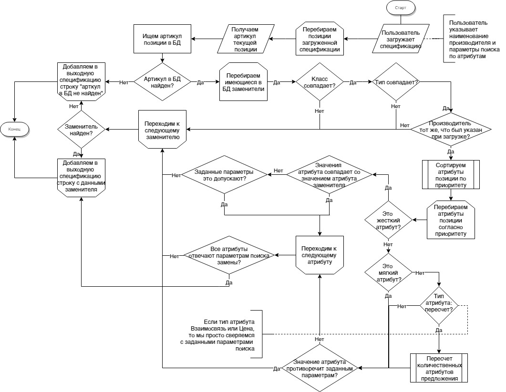

========================================================
Частное техническое задание на разработку Системы Analog
========================================================

1. Определения, сокращения и аббревиатуры
-----------------------------------------

+--------------+--------------------+------------------------------------+
| Аббревиатура | Термин             | Определение                        |
+==============+====================+====================================+
|              | Сущность           | Тип сведений, хранящихся в Базе    |
|              |                    | данных, имеющих одинаковые по      |
|              |                    | структуре свойства (поля)          |
+--------------+--------------------+------------------------------------+
|              | Экземпляр сущности | Уникально идентифицируемая единица |
|              |                    | сведений, хранящихся в БД,         |
|              |                    | относящаяся к какой-либо из        |
|              |                    | сущностей Системы                  |
+--------------+--------------------+------------------------------------+
| CRUD         | create, read,      | акроним, обозначающий четыре       |
|              | update, delete —   | базовые функции, используемые при  |
|              | «создать, прочесть,| работе с персистентными хранилищами|
|              | обновить, удалить» | данных:                            |
|              |                    |                                    |
|              |                    |   - создание;                      |
|              |                    |   - чтение;                        |
|              |                    |   - редактирование;                |
|              |                    |   - удаление.                      |
+--------------+--------------------+------------------------------------+

2. Общие сведения
-----------------

Система **Analog** служит для подбора аналогов позиций спецификации 
предложений товаров, а также для учета производителей, товаров, 
предложений производителей и т. д.

3. Бизнес-процессы
------------------

3.1 ведение (учет) экземпляров сущностей
----------------------------------------

:Шаг 1: Пользователь с правами Администратора авторизуется в панели Администратора
:Шаг 2: Открывает табличное представление справочника, в который требуется внести изменение
:Шаг 3:
  Внесение изменений:

  1. Пользователь прямо из табличного представления удаляет одну или несколько записей, 
     удаление перемещает запись в архив
  2. Для добавления записи пользователь нажимает соответствующую кнопку в табличном представлении, 
     переходит на страницу карточки экземпляра сущности, заполняет ее и нажимает сохранить
  3. Для редактирования записи, пользователь находит ее в таблице, открывает карточку данной записи, 
     вносит изменения и нажимает кнопку сохранить.

3.2 подбор аналогов
-------------------

:Шаг 1: Пользователь авторизуется в системе
:Шаг 2: 
  Выбирает пункт меню – загрузить спецификацию. Открывается окно с выбором файла для загрузки. 
  После нажатия ОК, появляется форма, в которой необходимо выбрать производителя, на котором 
  сделана загружаемая спецификация. Производитель выбирается из выпадающего списка. Подтверждается нажатием ОК.
:Шаг 3:
  Внесение параметров подбора: После загрузки спецификации и выбора производителя, 
  появляется окно с формой запроса параметров подбора спецификации-аналога.

  Форма состоит из трех частей.
  
  Первая часть. «автоматический подбор». Из выпадающего списка выбирается производитель, 
  на котором будет сделана исходящая спецификация. Внизу формы две кнопки – Атрибуты и ОК. 
  При выборе ОК – начинается подбор.
  
  Атрибуты – расширение формы вниз. Вторая часть. Форма динамическая! В этой части формы – 
  перечень «мягких» атрибутов для каждого класса. Напротив каждого атрибута – 
  значение по умолчанию с выпадающим списком возможных вариантов выбора. 
  В форму выбираются только те атрибуты тех классов, товары которых есть во входной спецификации. 
  «Лишние» классы и атрибуты  выводиться в форме не должны. Возможно разделение по классам для простоты понимания.
  
  Галочка к атрибуту «пересчет»
  
  Внизу также кнопки – Доп.атрибуты и ОК. при выборе ОК – начинается подбор. 
  
  Доп.Атрибуты – еще расширение формы вниз. Третья часть. В этой части формы – 
  перечень «жестких» атрибутов для каждого класса. Форма также динамическая. Напротив каждого атрибута – 
  значение по умолчанию с выпадающим списком возможных вариантов выбора.
  
Алгоритм поиска замены
  Загруженная спецификация отрабатывается построчно. Каждой строке в выходной спецификации должна 
  соответствовать строка исходной спецификации.

  Для каждого артикула i-той строки исходной спецификации производится поиск записи в БД. 
  В случае, если артикула исходн.спецификации в БД нет – в этой строке выходной спецификации 
  указывается – артикул в БД не найден. 
  
  Если артикул найден, то с учетом данных найденной записи производится поиск записи аналога. 
  Поиск производится с учетом того, что поля Класс, Тип должны полностью совпадать с параметрами 
  записи исходной позиции, поле Производитель – с наименованием Производителя выбранном в форме запроса.
  
  Поиск по атрибутам производится последовательно. Т.е. первый атрибут имеет больший приоритет перед последующим. 
  Для жестких атрибутов требуется полное совпадение значений с исходной записью, если иное не указано в форме запроса. 
  Для мягких атрибутов совпадения ищутся исходя параметров по умолчанию, если иное не указано в форме запроса. 
  
  После выбора позиции производится анализ атрибутов Пересчет, Взаимосвязь и Цена. Для атрибута Пересчет должен 
  производится пересчет количества с округлением вверх до целого элемента. 
  
  Выходная спецификация должна быть составлена в тех же ед. измерения, что и входная.

**Блок-схема алгоритма подбора замены:**

:Шаг 4: Сохранение результатов
  
  После проведения поиска у пользователя запрашивается место для сохранения файла с результатом. 
  Результат сохраняется в формате эксель. Столбцы – номер п/п, артикул, наименование, кол-во, ед.изм.

  В выходной спецификации на каждый элемент исходной спецификации должен быть представлен аналогичный 
  элемент в выходной спецификации (с учетом параметров «взаимосвязь» общее количество элементов может 
  незначительно отличаться). На один элемент исходной спецификации НЕ может быть представлено несколько 
  вариантов в выходной спецификации
  
  Пользователь может определять формат вывода информации – указывать какие столбцы должны быть в «выходной» спецификации.
  
  В БД должны сохраняться все произведенные подборы в формате – «исходная спецификация – выходная 
  спецификация» – с возможностью выгрузки для администратора единой совмещенной таблицы для удобного 
  анализа – что было на входе, что стало на выходе.

4. Декомпозиция архитектуры
---------------------------

4.1 публичная часть
-------------------
Доступ предоставляется всем пользователям Системы. 

Содержит следующий функционал:

:4.1.1: Загрузка спецификации и подбор аналогов
:4.1.2: Отображение ранее загруженных спецификаций
:4.1.3: Настройки пользователя (например, смена пароля)

4.2 панель администратора
-------------------------
Доступ предоставляется только пользователем с ролью Администратор. 

Включает следующий функционал:

:4.1.1: 
  *Каталог*

  Раздел учета экземпляров сущностей, касающихся работы со спецификациями.

:4.1.2:
  *Пользователи и группы*

  Раздел учета пользователей и групп и настройки прав доступа.

5 Сущности
----------

Все нижеописанные сущности должны расширять базовую сущность, а также следующие ее поля:

  - Кто создал (взаимосвязь с пользователем)
  - Когда создал
  - Кто последний обновил (взаимосвязь с пользователем)
  - Когда обновил
  - Опубликовано?
  - Уникальный идентификатор
  - Номер ревизии
  - Признак логического удаления/перемещения в архив

**В перечне полей ниже не указаны обратные взаимосвязи!**

1. **Производитель**

  Поля:

  - Наименование
  - Синонимы

2. **Класс** - крупная товарная категория, обладающая идентичными свойствами. Внутри класса атрибуты имеют одинаковые названия и свойства.  Внутри одного класса могут быть товары для которых не задействованы все атрибуты одновременно. Пример – для класса – кабеленесущие системы (КНС) есть жесткий атрибут – «вид», но для товара «крышка прямой секции» этот атрибут неактуален.

  Поля:

  - Наименование
  - Синонимы

3. **Вид (подкласс)** – подгруппа товаров внутри каждого класса, для более удобного поиска и классификации. Внутри одного вида каждого класса задействованы одинаковые атрибуты для всех позиций.

  Поля:

  - Наименование
  - Синонимы
  - Принадлежность к классу

4. **Атрибут** - разделены на типы - *Жесткий*, *Мягкий*, *Пересчет*, *Взаимосвязь*, *Цена*

  При поиске первоочередность атрибута имеет значение. Пример – атрибут B1 приоритетнее атрибута B2.
  
  **Жесткий атрибут**, группа А – как правило, такой тип жестко определяет подгруппу или свойство товаров, к которой должен относиться подбираемый аналог. Такой параметр жестко определяет важные свойства товара.
  
  По умолчанию все жесткие атрибуты подбираемого аналога должны в точности соответствовать жестким атрибутам исходной позиции
  
  Пример алгоритма: «продукт - кабельный лоток прямая секция, покрытие – холодный цинк, ширина – 500». Все перечисленные атрибуты должны в точности совпадать с подбираемым аналогом.
  
  **Мягкий Атрибут**, группа B  – как правило, такой тип имеет незначительную вариативность конкретного свойства товара у разных производителей. Как правило, отличия этих свойства не являются определяющими и критическими, однако требуют уточнения для нахождения аналога в процессе поиска. Также такой тип параметра требует уточнения принципа поиска, который задается при формировании запроса на подбор аналогов.  
  
  Пример алгоритма подбора - Мягкий атрибут для продукта каб.лоток прямая секция – «толщина – 0,8мм, высота борта – 50мм». При наличии нескольких вариантов выбора (т.е. все жесткие атрибуты совпадают), необходимо осуществлять подбор с учетом расширенных – мягких атрибутов. 
  
  По умолчанию – подбирается позиция с наиболее арифметически близким значением. 
  
  По умолчанию – приоритет подбора атрибутов – по порядку. Т.е. первоочередность атрибута имеет значение. Пример – атрибут B1 приоритетнее атрибута B2.
  
  При условии указаний пользовательских критериев поиска  - критерии задаются в форме запроса. Примеры критериев подбора для параметра «толщина»: не более, чем … мм, выбрать минимальный из имеющихся, выбрать максимальный из имеющихся, выбрать наиболее близкий к исходному.
  
  **Атрибут Пересчет**, группа C – подобранный элемент-аналог может совпадать по всем заданным параметрам, однако иметь другой размер. Например, длина исходной секции – 3000мм, а длина подобранного и полностью подходящего по всем параметрам аналога составляет 2000мм. В этом случае, необходимо соответствующим образом, пересчитать количество товара в «выходной» спецификации.
  
  Пример алгоритм подбора параметра Пересчет - в исходной спецификации количество может быть задано как в штуках, так и в метрах. Если задано в метрах – пересчитывать не нужно. Если задано в штуках, то необходимо 1. уточнить – есть ли разница в длине кабельных лотков – исходного и подбираемого  2. Если разница есть, то перевести исходное кол-во в метры, а затем метры поделить на длину подбираемого лотка, округлить в большую сторону.
  
  **Атрибут Взаимосвязь** – определяет наличие взаимосвязей между элементами. Так, например, для крепления крышки у одного производителя не требуется доп.элементов, а у другого необходимы клипсы. (см.пример)
  
  **Атрибут Цена** – без комментариев

  Поля:

  - Тип
  - Наименование
  - Приоритет
  - Принадлежность к Виду/типу товаров

5. Значение атрибута

  - Значение
  - Принадлежность к атрибуту
  - Принадлежность к товару

6. Товар

  - Наименование
  - Принадлежность к виду
  - Значения атрибутов

7. Предложение - принадлежит какому-либо производителю и только одному.

  - Производитель
  - Товар
  - Артикул. *У каждой позиции внутри одного производителя есть уникальный артикул. Артикулы разных производителей, теоретически могут иметь повторения.*
  - Значения атрибутов

8. Спецификация

  - Наименование
  - Позиции (предложения)

9. Пользователь

  - Имя пользователя
  - Принадлежность к группам
  - Электронная почта

10. Группы пользователей

  - Наименование
  - Права

6. Представления
----------------

1. Таблица/перечень
2. Карточка экземпляра сущности
3. Другое

7. Роли
-------

Администратор
  Пользователь, имеющий CRUD права сущности и их экземпляры
Менеджер
  Пользователь, имеющий права на создание и редактирование спецификаций

8. Справочники и классификаторы
-------------------------------

Производители
  - A
  - XX
Классы
  - ШП
  - КНС
Виды/типы
  - ШП

    - Поворотный модуль

  - КНС

    - Прямая секция
Атрибуты
  - КНС/Прямая секция
    
    A. Жесткие

      1. Вид
      2. Покрытие
      3. Ширина, мм
      
    B. Мягкие
      
      1. Толщина, мм
      2. Высота борта, мм

    C. Пересчет

      1. Длина, мм

    D. Взаимосвязь

      1. Крепление

    E. Цена

      1. руб.

  - ШП/Поворотный модуль

    A. Жесткие

      1. Вид
      2. Проводник
      3. Номинал, А
      4. Количество проводников

    B. Мягкие

      1. Корпус

    C. Пересчет

      1. Длина, мм

    E. Цена

      1. руб.
Типы атрибутов
  - Жесткий
  - Мягкий
  - Пересчет
  - Взаимосвязь
  - Цена

9. Требования к отказоустойчивости
----------------------------------

Требуется выполнять резервное копирование БД 1 раз в сутки в ночное время.